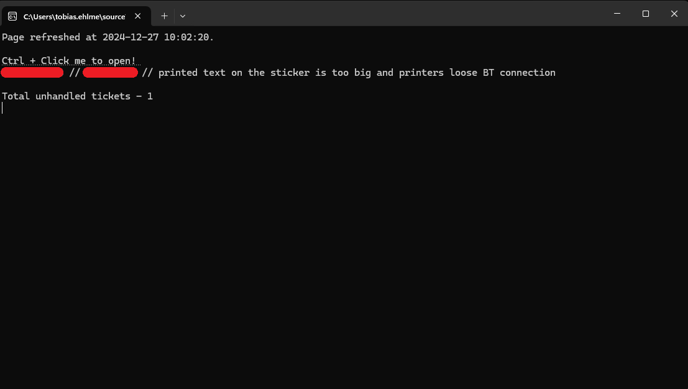

# RefreshJira

My Companys Jira doesn't support auto refresh in our support queue.
I made this little app so I don't need to manually refresh.
The app also displays the unopened tickets.

<picture></picture

## Requirements
Chrome

## Setup
Start the application -> Manually login through the browser which the app opened (first time) -> Follow instructions in the console app.
